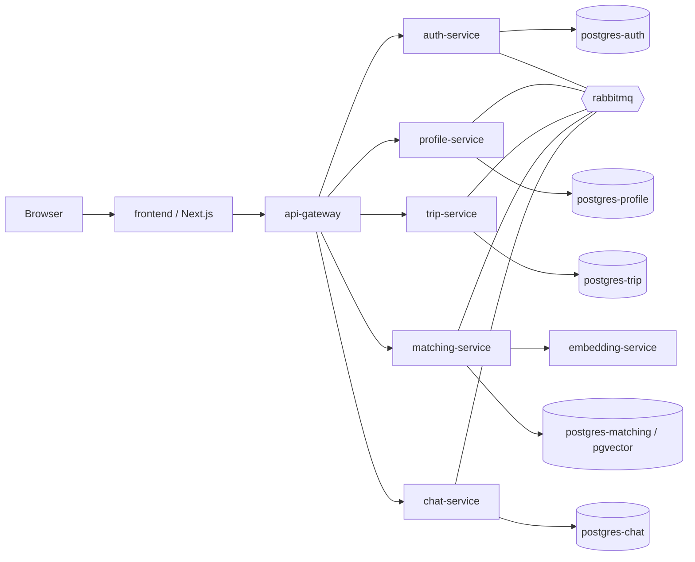

# Travel Buddy

Travel Buddy is a platform for planning trips and finding compatible travel companions. Users build a profile with their interests, create trips with itineraries, and get matched with other travelers based on semantic similarity of interests and trip plans. Matched users can chat in real time.

The backend is split into six Spring Boot services plus a Python embedding service, all behind a single API gateway, with a Next.js frontend on top. It's built as a microservices project rather than a monolith on purpose, to work with service boundaries, inter-service communication, message queues, and observability in a realistic setup.

## How it works

1. A user registers and logs in through **auth-service**, which issues a JWT.
2. They fill out a profile and pick interests through **profile-service**.
3. They create trips and itineraries through **trip-service**.
4. **matching-service** builds vector embeddings (via **embedding-service**, using sentence-transformers) from profile interests and trip data, stores them in Postgres with pgvector, and finds similar users through nearest-neighbor search.
5. Matched users message each other through **chat-service** over WebSocket (STOMP).

All application traffic goes through **api-gateway**, which handles routing, JWT validation, and CORS.

## Architecture



More detailed diagrams (ER diagrams, sequence diagrams, deployment topology, observability) are in [docs/diagrams](docs/diagrams).

## Tech stack

**Backend services** (auth, profile, trip, matching, chat, api-gateway): Java 17, Spring Boot, Spring Cloud Gateway, Spring Data JPA, Spring Security, Feign clients for inter-service calls, RabbitMQ for async messaging.

**Embedding service**: Python, FastAPI, sentence-transformers, torch.

**Frontend**: Next.js (App Router), TypeScript, Tailwind, shadcn/ui components, STOMP over WebSocket for chat.

**Data**: PostgreSQL (one database per service), pgvector for embedding similarity search.

**Observability**: Grafana, Prometheus, Loki, Tempo, Promtail, wired up for metrics, logs, and distributed tracing across services.

**Infra**: Docker Compose for local orchestration.

## Running it locally

You'll need Docker and Docker Compose installed.

Create a `.env` file in the project root with the following variables:

```
POSTGRES_USER=
POSTGRES_PASSWORD=
RABBITMQ_USER=
RABBITMQ_PASSWORD=
JWT_SECRET=

AUTH_DB_URL=jdbc:postgresql://postgres-auth:5432/auth_db
PROFILE_DB_URL=jdbc:postgresql://postgres-profile:5432/profile_db
TRIP_DB_URL=jdbc:postgresql://postgres-trip:5432/trip_db
MATCHING_DB_URL=jdbc:postgresql://postgres-matching:5432/matching_db

AUTH_SERVICE_URI=http://auth-service:8081
PROFILE_SERVICE_URI=http://profile-service:8082
TRIP_SERVICE_URI=http://trip-service:8083
MATCHING_SERVICE_URI=http://matching-service:8084
EMBEDDING_SERVICE_URI=http://embedding-service:8085
CHAT_SERVICE_URI=http://chat-service:8086

API_GATEWAY_URI=http://api-gateway:8080
```

Then bring the stack up:

```bash
docker compose up --build
```

This starts all databases, RabbitMQ, the observability stack, all backend services, and the frontend. It's a lot to run at once (17 containers), so on a machine with limited RAM you may want to bring up only the services you're working with instead of the full stack, for example:

```bash
docker compose up postgres-auth rabbitmq auth-service api-gateway frontend
```

Once running:

- Frontend: [http://localhost:3000](http://localhost:3000)
- API gateway: [http://localhost:8080](http://localhost:8080)
- Grafana: [http://localhost:3001](http://localhost:3001)
- Prometheus: [http://localhost:9090](http://localhost:9090)
- RabbitMQ management UI: [http://localhost:15672](http://localhost:15672)

## Project structure

```
backend/services/
  api-gateway/       routing, JWT validation, CORS
  auth-service/       registration, login, JWT issuing
  profile-service/    user profiles and interests
  trip-service/       trips and itineraries
  matching-service/   embedding-based matching, pgvector
  chat-service/       real-time messaging over WebSocket
  embedding-service/  Python/FastAPI, sentence-transformers
frontend/              Next.js app
observability/          Grafana, Loki, Tempo, Prometheus, Promtail config
docs/diagrams/          architecture and sequence diagrams
scripts/                helper scripts (seeding data, etc.)
```

## Tests

Backend services have unit tests runnable per service with Gradle, for example:

```bash
cd backend/services/auth-service
./gradlew test
```

CI runs these tests for every backend service and builds the frontend on every push and pull request against `master` and `dev`.
