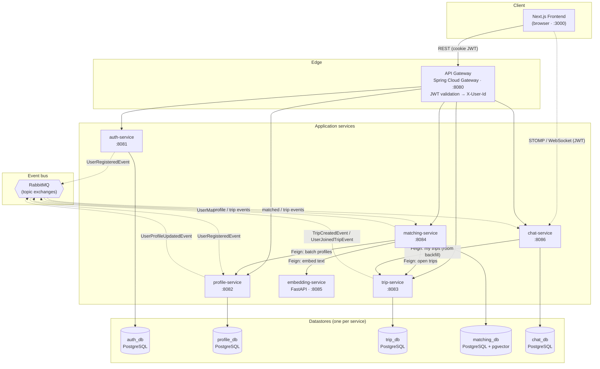

# System Architecture

TravelBuddy is a **microservice** system. A Next.js frontend talks to a single
**API Gateway**, which authenticates each request (validates the JWT cookie and
injects an `X-User-Id` header) and routes it to the owning service. Services are
loosely coupled: they call each other **synchronously** over HTTP (OpenFeign)
only where a request needs live data, and communicate **asynchronously** through
**RabbitMQ** events for everything else. Every service owns its **own database**
(database-per-service); there are no shared tables.

## Communication styles

| Style | Mechanism | Examples |
|-------|-----------|----------|
| **Client → system** | REST over the gateway; JWT in an `AUTH_TOKEN` cookie | every page/action |
| **Real-time** | Native WebSocket + STOMP, browser → chat-service directly | live chat messages |
| **Synchronous service → service** | Spring Cloud OpenFeign (HTTP) | matching → profile/trip/embedding, chat → trip |
| **Asynchronous service → service** | RabbitMQ topic exchanges | registration, profile/trip changes, matches |

## Event catalogue (RabbitMQ)

| Event | Published by | Consumed by | Effect |
|-------|--------------|-------------|--------|
| `UserRegisteredEvent` | auth-service | profile-service | create an empty profile for the new user |
| `UserProfileUpdatedEvent` | profile-service | matching-service | (re)compute the user's 384-d embedding |
| `TripCreatedEvent` | trip-service | matching-service, chat-service | embed the trip; create a trip chat room + share cards |
| `UserJoinedTripEvent` | trip-service | chat-service | add the user to that trip's chat room |
| `UserMatchedEvent` | matching-service | chat-service | create a direct-message room for the matched pair |
