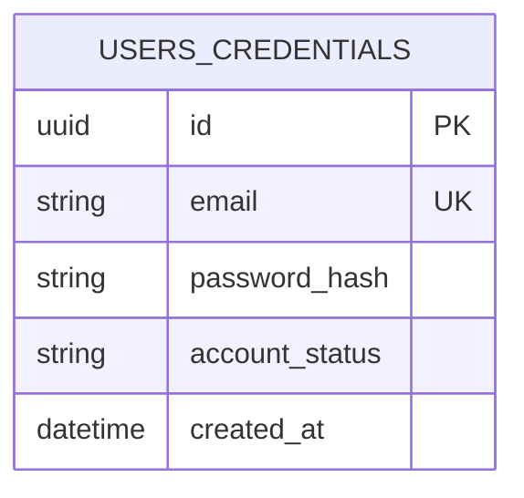
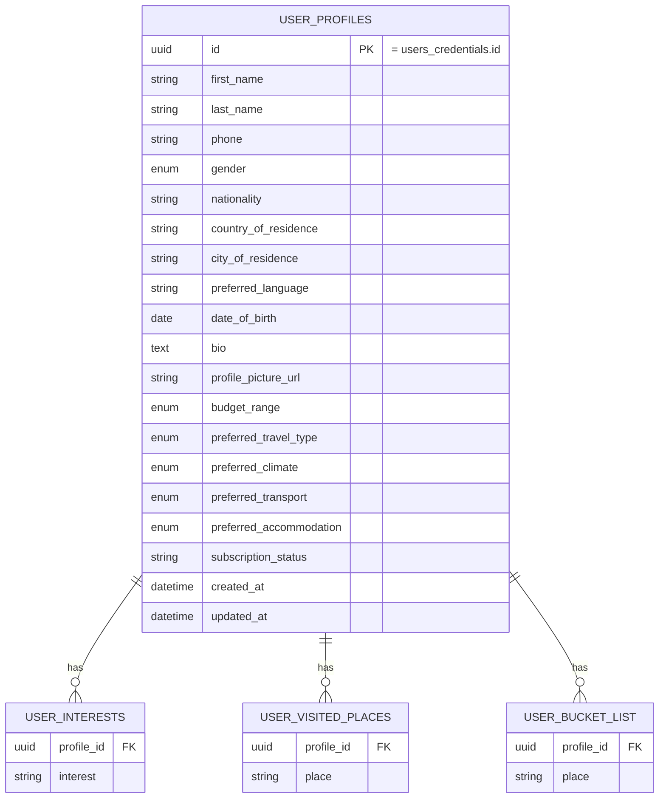
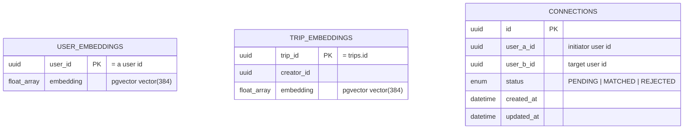
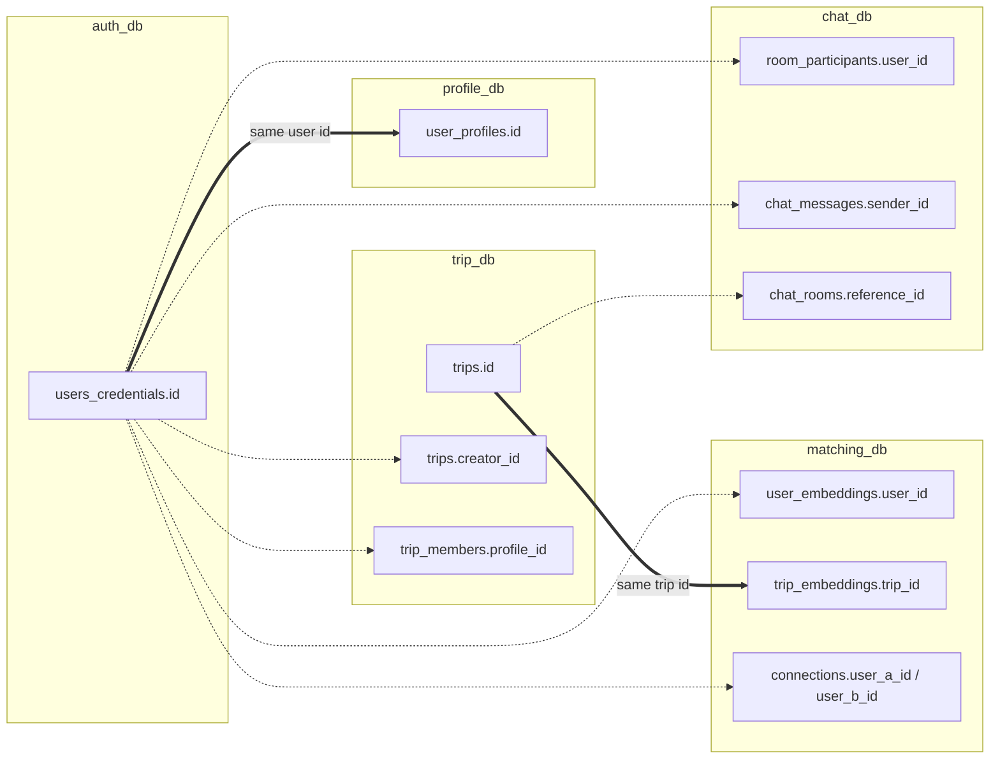

# Entity–Relationship Diagrams

Because TravelBuddy follows **database-per-service**, there is no single ER
schema and **no foreign keys cross a service boundary**. Each service owns an
isolated PostgreSQL database. The schemas are connected only *logically*, by
**shared identifiers** that travel through events and API calls:

- the **user id** minted by auth-service (`users_credentials.id`) is reused as
  the primary/owner key everywhere a user appears;
- the **trip id** (`trips.id`) is reused by the matching and chat services.

The last section shows those logical links explicitly.

---

## auth_db — auth-service



## profile_db — profile-service



## trip_db — trip-service

```mermaid
erDiagram
    TRIPS {
        uuid id PK
        string title
        text description
        uuid creator_id "= a user id"
        enum trip_type
        enum status
        int max_capacity
        datetime created_at
        datetime updated_at
    }
    TRIP_MEMBERS {
        uuid trip_id FK
        uuid profile_id "= a user id"
    }
    ITINERARIES {
        uuid id PK
        uuid trip_id FK UK
        timestamp start_time
        string start_name
        double start_lat
        double start_lng
        timestamp end_time
    }
    ITINERARY_STOPS {
        uuid id PK
        uuid itinerary_id FK
        int order_index
        string name
        double latitude
        double longitude
        timestamp arrival_time
        timestamp departure_time
    }
    TRIPS ||--o| ITINERARIES : "has one"
    TRIPS ||--o{ TRIP_MEMBERS : "joined by"
    ITINERARIES ||--o{ ITINERARY_STOPS : "contains"
```

## matching_db — matching-service (PostgreSQL + pgvector)



> These three tables have no relations *to each other*; they are queried
> independently (vector nearest-neighbour search for embeddings, status lookups
> for connections).

## chat_db — chat-service

```mermaid
erDiagram
    CHAT_ROOMS {
        uuid id PK
        enum type "DM | TRIP"
        uuid reference_id "trips.id for TRIP rooms, null for DM"
        string name "trip title for TRIP rooms"
        datetime created_at
    }
    ROOM_PARTICIPANTS {
        uuid id PK
        uuid room_id FK
        uuid user_id "= a user id"
        datetime joined_at
        datetime last_read_at
    }
    CHAT_MESSAGES {
        uuid id PK
        uuid room_id FK
        uuid sender_id "= a user id"
        text content
        enum type "TEXT | TRIP_SHARE"
        uuid trip_id "set for TRIP_SHARE"
        datetime sent_at
        datetime edited_at
        datetime deleted_at "soft delete"
    }
    CHAT_ROOMS ||--o{ ROOM_PARTICIPANTS : "has"
    CHAT_ROOMS ||--o{ CHAT_MESSAGES : "contains"
```



---

## Logical links across services (NOT database foreign keys)

The diagram below is conceptual: each edge is an identifier copied between
otherwise-isolated databases, kept consistent by events and Feign calls.


