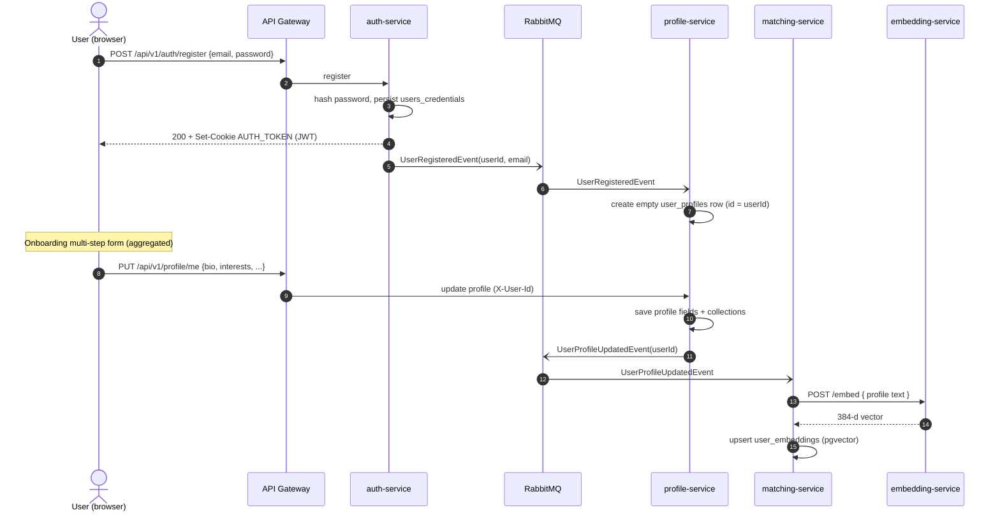
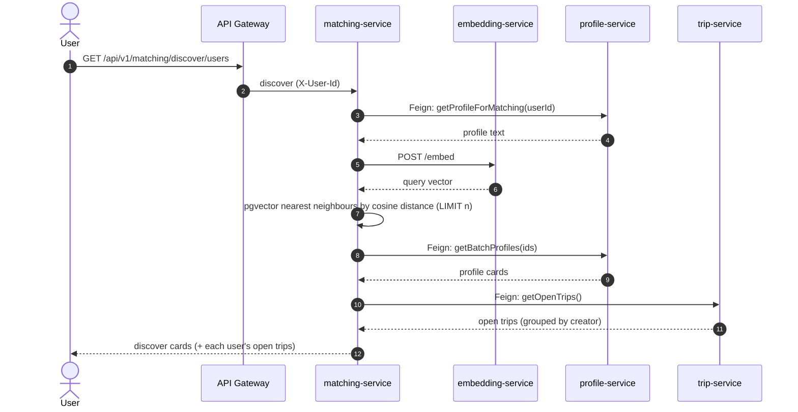
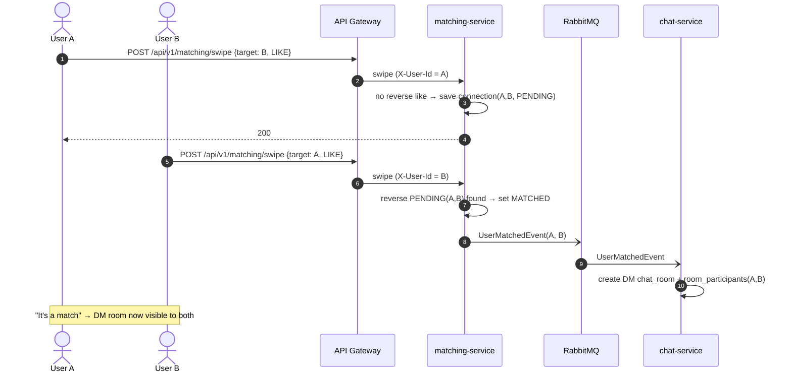
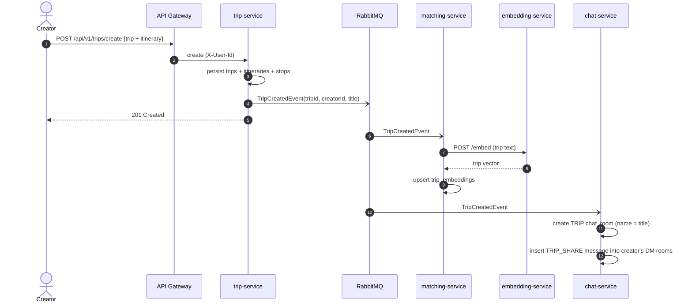
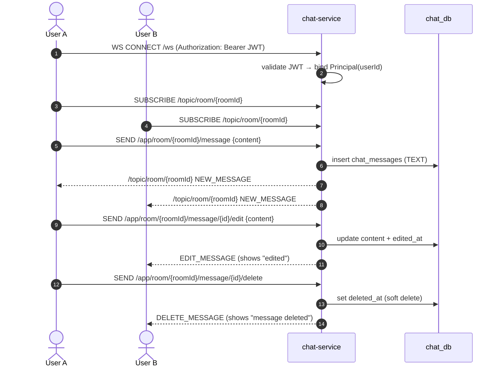

# Sequence Diagrams — Core Functions

These cover the five flows that define the product: onboarding a user, the
AI-powered discovery feed, swiping into a match, creating a trip (which seeds
chat), and real-time messaging.

---

## 1. Registration → profile bootstrap → onboarding

A new account is created synchronously; the empty profile is created
asynchronously off a `UserRegisteredEvent`; the onboarding form then fills the
profile, which triggers the user's embedding to be computed.

---

## 2. Discover feed (AI recommendation)

A single request fans out to three services. matching embeds the current user's
profile, finds nearest users by cosine distance in pgvector, then enriches the
result with live profile data and each candidate's open trips.

---

## 3. Swipe → mutual match → DM room

A like creates a `PENDING` connection. When the other side likes back, the
connection becomes `MATCHED` and a `UserMatchedEvent` makes chat-service open a
direct-message room for the pair.

---

## 4. Trip creation → trip room + auto-shared invite

Creating a trip both indexes it for matching and, in chat, opens a group room
and drops a `TRIP_SHARE` card into every DM the creator already has.

---

## 5. Real-time chat (WebSocket / STOMP) with edit & soft-delete

The browser connects to chat-service directly over a native WebSocket; the JWT
is validated on the STOMP `CONNECT` frame. Messages are broadcast to everyone
subscribed to the room topic. Edits and deletes reuse the same channel.

