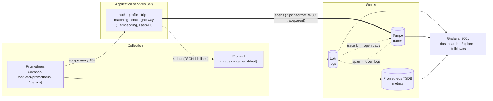
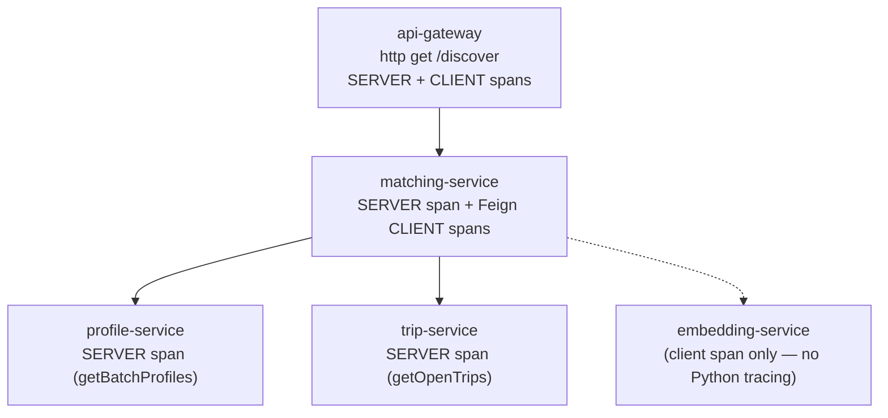

# Observability Architecture

Every service emits the **three pillars** — logs, metrics, traces — which are
collected by a Grafana stack (Loki, Prometheus, Tempo) and explored through a
single Grafana UI. The pillars are correlated by **trace id**: a log line links
to its trace, and a span links back to its logs.

## Pillars

| Pillar | Emitted by service | Transport | Stored in | Seen in Grafana |
|--------|--------------------|-----------|-----------|-----------------|
| **Logs** | SLF4J `HttpLoggingFilter` (full req/resp), Feign FULL logging | container stdout → Promtail | Loki | Explore → Loki, labelled `{service=...}` |
| **Metrics** | Micrometer → `/actuator/prometheus`; FastAPI `/metrics` | Prometheus scrape | Prometheus | "Service Overview" dashboard |
| **Traces** | Micrometer Tracing + OpenFeign propagation | Zipkin format → Tempo | Tempo | Explore → Tempo (TraceQL) |

## End-to-end trace example

A discover request produces **one** trace spanning the gateway and three
downstream services (the trace id is propagated as a W3C `traceparent` header,
including across the OpenFeign calls):

