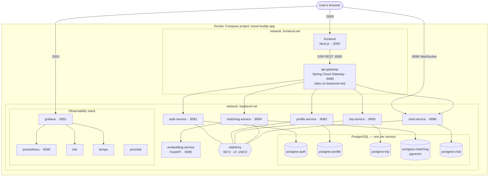

# Deployment / Container Topology

Everything runs as containers in one **Docker Compose** project on two bridge
networks: **`frontend-net`** (the only network exposed toward the user) and
**`backend-net`** (internal services, databases, broker, observability). The
**api-gateway** is attached to *both* networks and is the single ingress for the
application API. Each stateful container has a named volume.

> Only `frontend`, `chat-service` (WebSocket), and the ops UIs (`grafana`,
> `prometheus`) are meant to be reached **directly** from the browser. All
> application REST traffic goes **browser → frontend (SSR) → api-gateway →
> service**; the browser never calls the gateway or internal services directly.

## Published ports (host → container)

| Host port | Container | Purpose |
|-----------|-----------|---------|
| 3000 | frontend | web app |
| 8080 | api-gateway | application API ingress |
| 8081–8086 | auth / profile / trip / matching / embedding / chat | per-service (dev access) |
| 5672 / 15672 | rabbitmq | AMQP / management UI |
| 9090 | prometheus | metrics UI |
| 3001 | grafana | dashboards (logs + metrics + traces) |

## Named volumes (persistent state)

| Volume | Container | Holds |
|--------|-----------|-------|
| `postgres_auth_data` | postgres-auth | credentials |
| `postgres_profile_data` | postgres-profile | profiles |
| `postgres_trip_data` | postgres-trip | trips & itineraries |
| `postgres_matching_data` | postgres-matching | embeddings & connections |
| `postgres_chat_data` | postgres-chat | rooms & messages |
| `rabbitmq_data` | rabbitmq | broker state |

> Observability containers (Loki/Tempo/Prometheus/Grafana) use **ephemeral**
> storage and **read-only bind-mounts** for their config under
> `observability/` — so dashboards/datasources are provisioned as code, while
> stored logs/metrics/traces reset if the containers are removed.

## Image origin

- **Built from source** (Dockerfiles in `backend/services/*`, `frontend/`):
  the 6 Spring services, the FastAPI embedding service, the gateway, the frontend.
- **Off-the-shelf images**: `postgres:16`, `pgvector/pgvector:pg16`,
  `rabbitmq:3-management`, `grafana/loki`, `grafana/tempo`, `grafana/promtail`,
  `grafana/grafana`, `prom/prometheus`.
