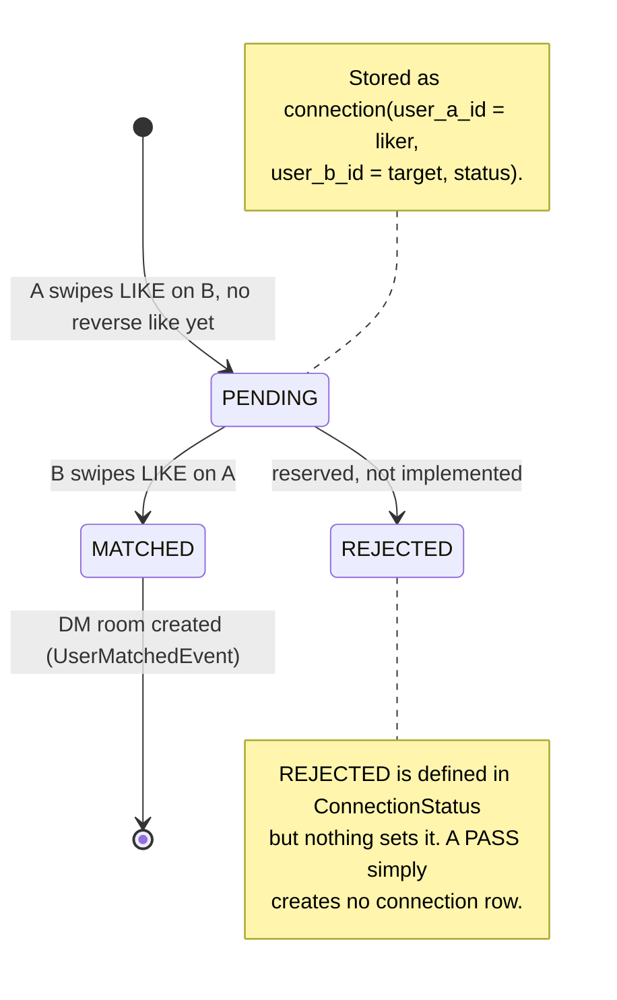
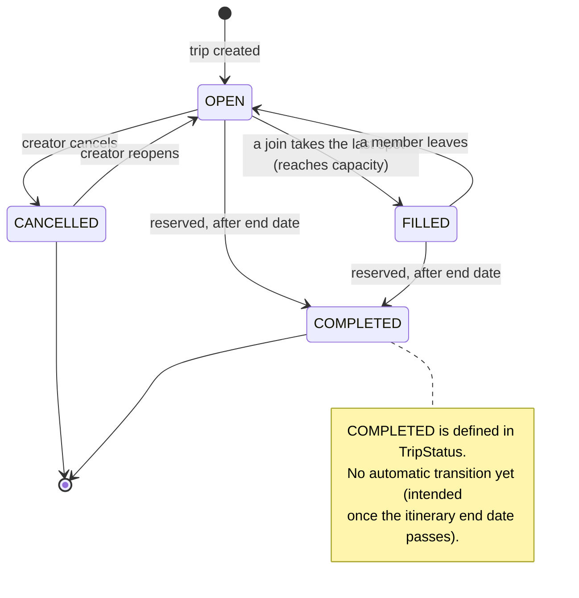

# State Diagrams

Lifecycles of the two stateful domain objects: a **connection** between two
users (matching-service) and a **trip** (trip-service). Transitions marked
*reserved* exist in the enum but are not yet triggered by code.

---

## Connection lifecycle (matching-service)

A "like" (swipe right) creates a one-directional `PENDING` connection. If the
other person likes back, it becomes `MATCHED`, which publishes a
`UserMatchedEvent` and opens a DM room. A "pass" creates **no** row at all.

**Implemented transitions**

| From | To | Trigger |
|------|----|---------|
| — | `PENDING` | first user likes the other (no existing reverse like) |
| `PENDING` | `MATCHED` | the other user likes back → `UserMatchedEvent` → DM room |
| `PENDING`/`MATCHED` | (no change) | a repeated like is idempotent |

---

## Trip lifecycle (trip-service)

A trip starts `OPEN`. It auto-fills to `FILLED` when the last spot is taken, and
falls back to `OPEN` if a member leaves. The creator can toggle `OPEN ⇄
CANCELLED`. `COMPLETED` is reserved for trips whose end date has passed.

**Implemented transitions**

| From | To | Trigger |
|------|----|---------|
| — | `OPEN` | trip created (also fires `TripCreatedEvent`) |
| `OPEN` | `FILLED` | a `joinTrip` reaches `max_capacity` |
| `FILLED` | `OPEN` | a `leaveTrip` frees a spot |
| `OPEN` | `CANCELLED` | creator sets status `CANCELLED` |
| `CANCELLED` | `OPEN` | creator sets status `OPEN` (reopen) |

> The creator's status endpoint only accepts `OPEN` or `CANCELLED`; `FILLED` is
> managed automatically by join/leave, and `COMPLETED` is reserved.
